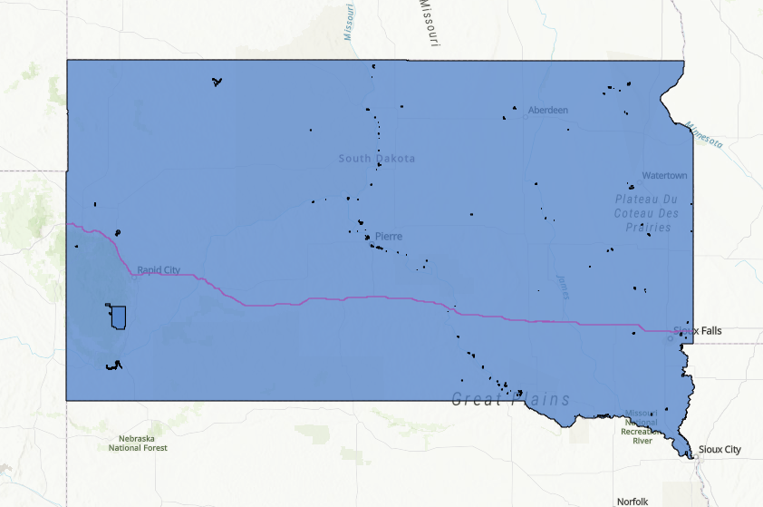

## Portfolio

---

### Current Projects

Suitability Study for Electric Vehicle Charging Stations

---

[State Parks in South Dakota, using Python](/sample_page)

---

[State Parks in South Dakota, using pgAdmin4/SQL, & Writing Sample](/pdf/Stone_OU_DataManagement_TermProject_SDParks.pdf)

---

[State Parks in South Dakota, using ArcGIS Online:](https://arcg.is/H5izW)

---

[Sentinel Fire Monitoring, using Google Earth Editor:](https://benjaminstone.users.earthengine.app/view/sentinel-fire-monitoring-split-map)

---

Page template forked from <a href="https://github.com/evanca/quick-portfolio">evanca</a>

<!-- Remove above link if you don't want to attibute -->
